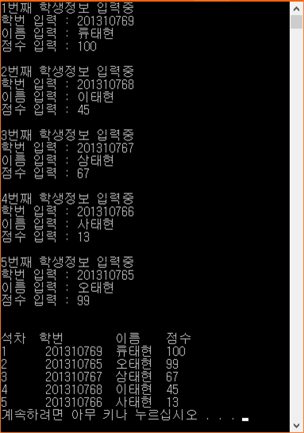

# ScoreManager_Aligner
* 성적 관리 프로그램

## 개요
* 5명의 성적을 키보드로 읽어 석차순으로 정렬하여 출력하는 프로그램

## 개발 목적
* 우송대학교 프로그램특론 중간고사 - 이전에 수강한 자료구조 및 알고리즘, C++ 이론을 응용한 과제

## 개발 기간
* 2017.01.08

## 기술 스택
* C++

## 개발 환경
* OS : Windows 8.1
* IDE : Visul Studio 2015

## 실행 화면
